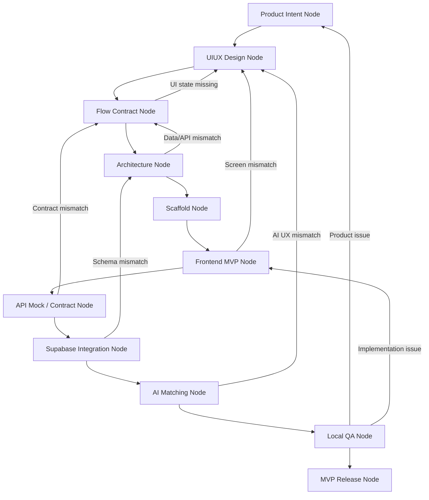

# BeerRank MVP Engineering Loop Guide

Status: Executing local MVP loop

Last updated: 2026-06-28

## Purpose

This document defines the engineering loop for building BeerRank from product intent to local MVP, then to public deployment.

BeerRank should not jump directly from design to code. Each node has:

- clear inputs
- clear outputs
- an exit gate
- a rollback/revisit path
- ownership between product, design, frontend, API, database, and AI

The goal is to make Codex and the human collaborator work from the same map, reducing repeated alignment during implementation.

## Project Storage

Repository root:

```text
C:\code\BeerRank
```

Application code root:

```text
C:\code\BeerRank\code
```

The outer project folder keeps product docs, design notes, workflow references, and generated artifacts. Application code lives under `code` to keep implementation separate from planning assets.

Recommended structure:

```text
C:\code\BeerRank
├─ code
│  ├─ apps
│  │  ├─ web
│  │  └─ api
│  ├─ packages
│  │  ├─ shared
│  │  └─ config
│  ├─ docker
│  ├─ docker-compose.yml
│  ├─ package.json
│  └─ README.md
├─ docs
│  ├─ specs
│  ├─ architecture.md
│  ├─ database.md
│  └─ api.md
├─ tasks
├─ stitch-export
├─ _open_design
└─ _workflow_ref
```

## MVP Technical Direction

Frontend:

- React
- TypeScript
- Vite
- CSS / CSS Modules first
- `react-router-dom`
- React state/context first
- Zustand only when state complexity demands it

API:

- NestJS
- TypeScript
- REST first
- DTO-first contracts
- Mock services before real external integrations

Auth / Database / Storage:

- Supabase Auth
- Google login
- Supabase PostgreSQL
- Supabase Storage for beer/post photos

AI Matching:

- Start with mock adapter and deterministic fake responses
- Later replace with OpenAI Vision or another image/text matching provider
- AI suggests Beer candidates only
- User confirmation is required before publishing

Local Development:

- Run on this machine first
- Use Docker where useful for service simulation
- Keep public deployment out of scope until local MVP is coherent

Public MVP Deployment:

- Zeabur for public app/API hosting
- Supabase hosted services for auth/database/storage

Out of MVP Scope:

- Admin backend
- Complex moderation console
- Advanced recommendation engine
- Payment/subscription
- Native mobile app

## Core Product Rules

BeerRank ranking integrity depends on these rules:

1. A user rating counts only after a published post exists.
2. A published ranking-eligible post must have:
   - author
   - beer photo
   - rating
   - confirmed Beer association
3. AI can suggest Beer candidates, but cannot finalize the Beer association.
4. The user must confirm an existing Beer or create a new Beer draft.
5. Beer Detail is the proof surface behind the leaderboard.
6. Leaderboard scores aggregate only verified, published reviews.

## Loop Overview



## Node 1: Product Intent

Objective:

Define what BeerRank is, why it exists, and what the MVP must prove.

Inputs:

- User product idea
- Personal hobby app goal
- Beer ranking/rating/social post concept

Outputs:

- Product rules
- MVP scope
- Non-goals
- Success criteria

Current references:

- `docs/product.md`
- `docs/intake.md`
- `docs/specs/feature-beer-rating-mvp-flow-architecture.md`

Exit gate:

- Core user journey is clear.
- Ranking eligibility rule is defined.
- MVP scope is small enough to build locally.

Can revisit when:

- The purpose of the app changes.
- Ranking rules change.
- MVP scope grows too large.

## Node 2: UIUX Design

Objective:

Produce and organize the screens needed to represent the MVP user journey.

Inputs:

- Product Intent outputs
- Stitch/Open Design/Figma outputs
- User feedback on visual direction

Outputs:

- Figma `MVP Canonical Flow`
- Figma `Source Map - Archive Notes`
- Prototype links
- UIUX review document

Current references:

- Figma file: `BeerRank design copy`
- Figma page: `MVP Canonical Flow`
- `docs/specs/feature-beer-rating-mvp-figma-review.md`
- `docs/specs/feature-beer-rating-mvp-design.md`
- Missing states added to `MVP Canonical Flow`: comments, visibility, multi-photo, publish success, create Beer, AI no-results.

Exit gate:

- Canonical screens are separated from old iterations.
- Main prototype flow is testable.
- Missing states are known.
- Screens can map to routes/components.

Can revisit when:

- A required state is missing.
- Prototype feels confusing.
- Frontend implementation reveals UX gaps.

Known missing UI states:

- Review disabled states:
  - missing photo
  - missing rating
  - Beer unconfirmed
- Publish success
- AI no result
- Create new Beer flow
- Profile signed-out vs signed-in split
- Leaderboard formula info sheet

## Node 3: Flow Contract

Objective:

Translate Figma screens into implementation contracts.

Inputs:

- Figma canonical screens
- Prototype links
- Product rules

Outputs:

- Route map
- Component map
- UI state map
- Event/action map
- Data requirements per screen

Current contract document:

- `docs/specs/feature-beer-rating-mvp-flow-contract.md`

Current status:

- Accepted for Node 4 Architecture with reversible MVP defaults.

Current route map:

| Route | Purpose |
| --- | --- |
| `/feed` | Social beer post feed |
| `/review/new` | Add beer review composer |
| `/review/new/match` | AI Beer match confirmation/search |
| `/beers/:beerId` | Beer detail and proof reviews |
| `/leaderboard` | Global/style leaderboard |
| `/profile` | User profile and sync/login |

Exit gate:

- Every Figma screen has a route or modal owner.
- Every major click has a target.
- Every UI state has data dependencies.
- Missing screens are explicitly listed.

Can revisit when:

- A route is awkward.
- A component needs data not defined by the contract.
- A user action has no owner.

## Node 4: Architecture

Objective:

Define system boundaries before code generation.

Inputs:

- Flow Contract
- Technical direction
- Local development constraints

Outputs:

- App architecture
- API architecture
- DB model draft
- Service boundaries
- Local Docker plan

Current architecture document:

- `docs/specs/feature-beer-rating-mvp-architecture.md`

Current recommended boundary:

```text
Web app
  -> calls NestJS API
    -> reads/writes Supabase PostgreSQL
    -> stores images in Supabase Storage
    -> delegates auth/session verification to Supabase Auth
    -> calls AI Match adapter
```

Important boundary:

- Frontend owns UI state and route transitions.
- API owns business rules and ranking eligibility.
- Database owns canonical records and constraints.
- AI adapter owns suggestions only.
- User confirmation owns final Beer association.

Exit gate:

- Web/API/database responsibilities are clear.
- No direct hidden ranking logic in the frontend.
- AI matching is replaceable.
- Local development can run without production services where possible.

Can revisit when:

- API endpoints become too coupled to UI.
- Supabase schema cannot support the flow.
- AI matching requires a different contract.

## Node 5: Scaffold

Objective:

Create the application code workspace.

Inputs:

- Architecture Node outputs
- Confirmed storage location

Outputs:

- `C:\code\BeerRank\code`
- frontend app
- NestJS API app
- shared package
- local scripts
- Docker scaffolding

Proposed initial structure:

```text
code
├─ apps
│  ├─ web
│  │  ├─ src
│  │  ├─ package.json
│  │  └─ vite.config.ts
│  └─ api
│     ├─ src
│     ├─ package.json
│     └─ nest-cli.json
├─ packages
│  └─ shared
│     └─ src
├─ docker
├─ docker-compose.yml
├─ package.json
└─ README.md
```

Exit gate:

- `apps/web` can run locally.
- `apps/api` can run locally.
- web and api ports are documented.
- shared types can be imported or copied cleanly.

Can revisit when:

- Monorepo tooling becomes too heavy.
- Frontend/API coupling changes.
- Docker setup conflicts with local machine constraints.

## Node 6: Frontend MVP

Objective:

Implement the Figma canonical flow as a working React app using mock data first.

Current status:

Accepted for Node 7 after local UIUX review. The first React/Vite frontend is running locally on `http://127.0.0.1:6677/`, with Feed, Review Composer, AI Match, Beer Detail, Leaderboard, Profile, login sheet, comments sheet, and refined bottom navigation represented.

Inputs:

- Figma canonical flow
- Route map
- Component map
- Mock data contract

Outputs:

- React routes
- App shell
- Feed
- Add Review
- AI Match
- Beer Detail
- Leaderboard
- Profile
- Mock state transitions

Recommended component groups:

```text
features/feed
features/review
features/beer
features/leaderboard
features/profile
components/app-shell
components/ui
data/mock
lib/routing
```

Exit gate:

- User can click through the MVP flow locally.
- Mock data demonstrates ranking rules.
- UI roughly matches Figma structure.
- Missing states are either implemented or documented.

Can revisit when:

- Screen implementation exposes design gaps.
- Component structure becomes unclear.
- User flow feels wrong in browser.

## Node 7: API Mock / Contract

Objective:

Create a NestJS API contract that supports the frontend before integrating real services.

Current status:

Accepted for public mock deployment. Mock REST endpoints, Swagger, deployed frontend/API, and API-to-PostgreSQL health check are working. Endpoints still return mock data except for database health.

Inputs:

- Flow Contract
- Frontend data needs

Outputs:

- REST endpoints
- DTOs
- mock service implementations
- shared types if needed

Initial API candidates:

| Method | Path | Purpose |
| --- | --- | --- |
| `GET` | `/api/feed` | List published review posts |
| `GET` | `/api/beers/:beerId` | Beer detail and proof reviews |
| `GET` | `/api/leaderboard` | Ranking list, with optional style filter |
| `GET` | `/api/posts/:postId/comments` | Comment thread for a post |
| `POST` | `/api/reviews` | Publish a review |
| `POST` | `/api/ai/beer-match` | Suggest Beer candidates |
| `GET` | `/api/me` | Current user profile mock |

Exit gate:

- Frontend can switch from local mock data to API mock responses.
- DTOs represent the UI data needs.
- Ranking eligibility is represented in the API layer.

Can revisit when:

- UI needs new data.
- DB schema changes.
- AI matching contract changes.

## Node 8: Supabase Integration

Objective:

Replace mock persistence with Supabase Auth, PostgreSQL, and Storage.

Current status:

Adapted for Zeabur PostgreSQL first. The API can connect to Zeabur PostgreSQL through `DATABASE_URL`, but schema, persistence, auth, and storage are not implemented yet.

Inputs:

- API contract
- DB model
- Supabase project credentials

Outputs:

- Supabase Auth setup
- Google login
- database schema/migrations
- storage bucket rules
- API service implementation

Initial DB entities:

- users/profiles
- beers
- breweries
- reviews/posts
- review_photos
- reactions
- ai_match_suggestions
- leaderboard views or query services

Exit gate:

- User can sign in with Google.
- User can publish a photo review.
- Published review is tied to a confirmed Beer.
- Ranking queries exclude invalid reviews.

Can revisit when:

- Auth/session rules are unclear.
- Storage access rules are too permissive.
- Ranking query becomes too complex.

## Node 9: AI Matching

Objective:

Make AI-assisted Beer matching replaceable and auditable.

Current status:

Mock endpoint exists at `POST /api/ai/beer-match`. Real AI image/text matching, provider configuration, suggestion persistence, and Beer catalog matching are not implemented yet.

Inputs:

- Photo upload
- optional Beer name
- optional brewery/style/location
- Beer catalog

Outputs:

- candidate Beer suggestions
- confidence score
- reason fields
- user confirmation result

Adapter contract:

```ts
type BeerMatchStatus =
  | "suggested"
  | "accepted"
  | "rejected"
  | "manual_search"
  | "new_beer_created";
```

Important rule:

AI output is never final. It only creates suggestions.

Exit gate:

- AI mock can return high-confidence and low-confidence states.
- User can accept, search manually, or create a new Beer.
- Review cannot publish until Beer is confirmed.

Can revisit when:

- AI suggestions are confusing.
- Confidence UX is unclear.
- Provider changes from mock to real model.

## Node 10: Local QA

Objective:

Validate the MVP locally before public deployment.

Inputs:

- Working frontend
- Working API
- Supabase integration or local mock services

Outputs:

- QA checklist
- known issues
- bug fixes
- deployment readiness decision

QA checklist:

- Feed loads posts.
- User can start Add Review.
- User can upload/select photo placeholder.
- AI high-confidence path works.
- AI low-confidence/manual path works.
- Review publish enforces required fields.
- Published review appears in Feed.
- Beer Detail shows proof reviews.
- Leaderboard uses eligible reviews only.
- Profile reflects signed-in/signed-out state.

Exit gate:

- MVP flow can be completed end-to-end.
- Known blockers are resolved or explicitly deferred.
- Deployment environment variables are known.

Can revisit when:

- QA exposes product gaps.
- Implementation does not match Figma.
- API/data rules are inconsistent.

## Node 11: MVP Release

Objective:

Deploy a public version after local MVP is coherent.

Inputs:

- Local QA passed
- Supabase configured
- Environment variables prepared

Outputs:

- Zeabur deployment
- public URL
- smoke test notes
- release log

Exit gate:

- Public app loads.
- Auth works in deployed environment.
- API reaches Supabase.
- Image upload works.
- Ranking data is visible.

Can revisit when:

- Deployment constraints require architecture changes.
- Zeabur config differs from local assumptions.
- Supabase policies block public flow.

## Work Policy For Codex

Before entering a node:

1. Confirm the active node.
2. Read the node's inputs.
3. Check whether required outputs from prior nodes exist.
4. State assumptions.
5. Execute only the node's scope.

During a node:

- Keep changes scoped.
- Update docs when decisions change.
- Prefer reversible changes.
- Do not delete design/source artifacts unless explicitly requested.
- Do not mix frontend, API, DB, and deployment work in one step unless the node requires it.

After a node:

1. Verify outputs.
2. Record what changed.
3. List remaining gaps.
4. Decide whether to proceed, revisit, or stop.

## Current Project Position

Current node:

```text
Node 8: PostgreSQL Integration / Node 9 preparation
```

Completed:

- Product concept defined.
- Beer ranking eligibility rule defined.
- Figma canonical flow created.
- Figma source/archive notes created.
- First-pass Figma prototype links added.
- UIUX review documented.
- Flow Contract draft created.
- Flow Contract accepted for architecture.
- Node 4 Architecture draft created.
- Node 5 Scaffold started.
- Initial web/API/shared workspace created under `C:\code\BeerRank\code`.
- First-pass React mock frontend started and served at `http://127.0.0.1:6677/`.
- Public frontend deployed to `https://beer-rank.zeabur.app/`.
- Public API deployed to `https://api-beer-rank.zeabur.app/api`.
- Zeabur PostgreSQL health check passes through `/api/health`.

Next recommended node:

```text
L01 - DB Schema And Migration
```

Before executing the next loop item, confirm:

- `tasks/current/mvp-loop-backlog.md`
- deployed API has `DATABASE_URL`
- migration runner strategy
- seed data scope

Backlog reference:

```text
tasks/current/mvp-loop-backlog.md
```
