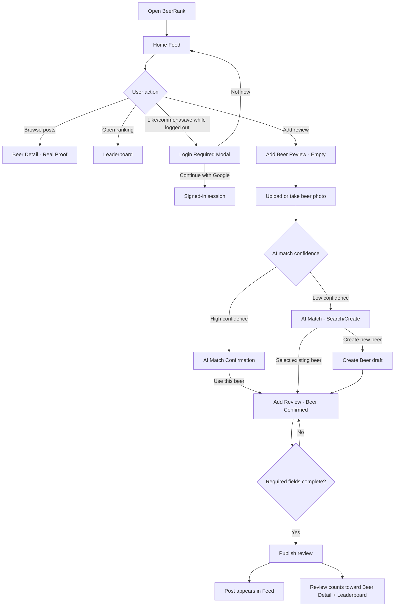

# BeerRank Figma UIUX Review

Source: Figma file `BeerRank design copy`

File key: `nv0mNePH0R4xO2LAPhiceB`

Review date: 2026-06-27

## 2026-06-27 Execution Log

Figma file updates completed:

- Created page `MVP Canonical Flow`.
- Copied 9 canonical MVP screens into product-flow order.
- Added labels and handoff notes above each canonical screen.
- Created page `Source Map - Archive Notes`.
- Added canonical screen to route mapping inside Figma.
- Added archive notes for old/superseded Stitch iterations.
- Added missing MVP states list for the next design pass.
- Added first-pass prototype links on `MVP Canonical Flow`.

New Figma working pages:

| Page | Purpose |
| --- | --- |
| `Page 1` | Original Stitch/Figma source output. Keep untouched as source history. |
| `MVP Canonical Flow` | Main development handoff page. Use this for route and component planning. |
| `Source Map - Archive Notes` | Canonical/archive/missing-state reference table. |

Canonical Figma flow order:

1. `01 Feed / Home`
2. `02 Feed / Login Required`
3. `03 Review / Empty Composer`
4. `04 AI Match / High Confidence`
5. `05 AI Match / Low Confidence`
6. `06 Review / Beer Confirmed`
7. `07 Beer Detail / Real Proof`
8. `08 Leaderboard / Verified Ranking`
9. `09 Profile / Sync & Reviews`

Prototype links added:

- Feed/post taps navigate to `07 Beer Detail / Real Proof`.
- Login modal actions return to `01 Feed / Home` as an auth-placeholder flow.
- `03 Review / Empty Composer` navigates to `04 AI Match / High Confidence`.
- AI high-confidence `Use this beer` navigates to `06 Review / Beer Confirmed`.
- AI manual/low-confidence selection navigates to `06 Review / Beer Confirmed`.
- `06 Review / Beer Confirmed` publish placeholder returns to `01 Feed / Home`.
- `07 Beer Detail / Real Proof` Add My Review navigates to `06 Review / Beer Confirmed`.
- Leaderboard beer rows navigate to `07 Beer Detail / Real Proof`.
- Bottom navigation links were wired where matching nodes exist.

Prototype limitations:

- Active bottom-nav items that point to their current screen were not wired because Figma rejects self-navigation.
- `Publish success` is not designed yet; publish currently returns to Feed as a placeholder.
- `Create New Beer` is not designed yet; create-new currently returns to the Add Review composer as a placeholder.
- Some frame-level click targets are intentionally broad until CTA hotspots/components are cleaned up.

## 2026-06-27 UIUX Loopback Execution

Reason:

- Product decisions changed during Flow Contract review.
- MVP now requires Traditional Chinese + English UI support, up to 3 photos per review, comment threads, and public/private visibility.
- Only public reviews should count toward leaderboard scoring and public proof feeds.

Figma update:

- Figma Starter plan blocked creating a fourth page, so missing states were appended to `MVP Canonical Flow`.
- Added section label `Missing MVP UIUX States`.
- Added six new frames:
  1. `10 Comments / Thread Sheet`
  2. `11 Review / Visibility Selector`
  3. `12 Review / Multi Photo Upload`
  4. `13 Review / Publish Success`
  5. `14 AI Match / Create New Beer`
  6. `15 AI Match / No Results`

Notes:

- These are first-pass UIUX states for flow validation.
- Prototype links were added for the new missing states.
- They still need visual refinement.
- The current text is English placeholder copy; implementation should support Traditional Chinese and English via locale strings.

New prototype links:

- Feed comment action opens `10 Comments / Thread Sheet`.
- Comment sheet returns to Feed.
- Visibility selector returns to composer.
- Multi-photo upload returns to composer.
- Review confirmed publish now routes to `13 Review / Publish Success`.
- Publish success can route to Feed or Beer Detail.
- AI low-confidence can route to `15 AI Match / No Results`.
- AI no-results can route to `14 AI Match / Create New Beer`.
- Create Beer confirms Beer and returns to Review confirmed.

## Current Screens

The Figma file currently contains 12 top-level mobile frames.

| Frame | Role | Keep For MVP |
| --- | --- | --- |
| BeerRank Home Feed | Main social feed | Yes |
| Add Beer Review | Empty/unconfirmed review composer | Yes |
| Beer Detail - Citra IPA | Original beer detail | Merge into enhanced version |
| AI Beer Match Confirmation | High-confidence AI match | Yes |
| BeerRank Leaderboard | Original leaderboard | Merge into trust-hint version |
| User Profile | Original profile | Merge into updated sync version |
| AI Match - Low Confidence & Search | Low-confidence AI + manual search | Yes |
| Add Review - Confirmed State | Confirmed beer composer | Yes |
| Leaderboard - With Trust Hint | Ranking proof explanation | Yes |
| Home Feed - Login Modal State | Auth gate modal | Yes |
| User Profile - Updated Sync | Google sync/profile state | Yes |
| Beer Detail - Enhanced Real Proof | Best beer detail direction | Yes |

## Recommended Screen Organization

Keep these as canonical MVP screens:

1. `Feed / Home`
2. `Feed / Login Required Modal`
3. `Review / Add - Empty`
4. `Review / AI Match - High Confidence`
5. `Review / AI Match - Low Confidence Search`
6. `Review / Add - Beer Confirmed`
7. `Beer / Detail - Real Proof`
8. `Leaderboard / Global`
9. `Profile / Signed In`
10. `Profile / Login Sync Prompt`

Move older duplicates into a `Archive - Stitch Iterations` page or section:

- `Beer Detail - Citra IPA`
- `BeerRank Leaderboard`
- `User Profile`

## MVP User Flow

## UIUX Review

### 1. Feed

What works:

- The feed finally feels closer to a social product: post cards, beer photo, user header, rating, review text, and social actions are all present.
- Bottom navigation makes the app feel mobile-native.

Needs modification:

- Add a clear tap target from beer name/photo into `Beer Detail`.
- Show a compact verified indicator when a post counts toward ranking.
- Clarify what social actions do when signed out: like/comment/save should trigger the login modal.
- Feed currently uses English sample content; decide whether MVP interface is English, Traditional Chinese, or bilingual.

### 2. Add Review

What works:

- The required publishing rule is represented: photo, rating, beer name, brewery/style/location, review.
- The confirmed state adds `Confirmed: Citra IPA` and a note that verified reviews contribute to rankings.

Needs modification:

- Split form state clearly:
  - Photo missing
  - Rating missing
  - Beer unconfirmed
  - Beer confirmed
  - Ready to publish
  - Publish success
- Add a visible disabled state and reason for `PUBLISH REVIEW`.
- Add post-publish success state: "Published", with actions to view Feed or Beer Detail.
- `Confirm with AI` should route into AI Match, not look like a generic helper button.

### 3. AI Match

What works:

- High-confidence and low-confidence states are both present.
- User confirmation is explicit, which supports the product rule that AI does not decide alone.

Needs modification:

- Low-confidence screen should not show `98% Match` as the first suggestion if the state says low confidence.
- Add confidence reason text: photo match, label text match, brewery/style match.
- Add manual search empty/error states:
  - No results
  - Too many similar beers
  - Create new Beer
- Add a confirm action result: after selecting a Beer, return to `Add Review - Confirmed State`.

### 4. Beer Detail

What works:

- `Beer Detail - Enhanced Real Proof` is the strongest direction.
- It explains ranking trust: only published reviews with photo, rating, and confirmed beer count.
- Real Proof feed makes the ranking feel auditable.

Needs modification:

- Add tabs or sections: Overview, Reviews, Stats.
- Add data provenance near score: number of verified reviews, last updated, ranking scope.
- Add CTA logic:
  - Signed out: `Add My Review` opens login modal.
  - Signed in: opens Add Review with this Beer preselected.
- Add "Report incorrect beer match" or "Suggest correction" for AI/user-generated beer data.

### 5. Leaderboard

What works:

- The trust-hint version is better than the original.
- Filters by style already exist.

Needs modification:

- The title/text wraps too aggressively: `Global Leaderboard` and `Rankings are based...` need cleaner hierarchy.
- Add sorting/ranking logic labels:
  - Highest Score
  - Most Reviewed
  - Trending
  - Near Me, optional later
- Each row should link to Beer Detail.
- Add "verified reviews only" badge and small explanation.
- Consider exposing score formula in a small info sheet.

### 6. Profile

What works:

- Basic stats, average rating, top style, reviews/saved/favorite styles are useful.
- Google sync prompt matches the third-party login plan.

Needs modification:

- Split into signed-out and signed-in profile states.
- Signed-out profile should prioritize Google login and explain benefits.
- Signed-in profile should show user's review grid/list and saved beers.
- Add settings entry: account, privacy, sign out.

## Frontend Route Mapping

| Route | Figma Frame | Main Components |
| --- | --- | --- |
| `/` or `/feed` | BeerRank Home Feed | AppShell, FeedList, ReviewPostCard, LoginRequiredModal |
| `/review/new` | Add Beer Review | ReviewComposer, PhotoUploader, RatingInput, BeerConfirmField |
| `/review/new/match` | AI Beer Match Confirmation / Low Confidence | BeerMatchConfirm, BeerSearchResults, CreateBeerPrompt |
| `/beers/:beerId` | Beer Detail - Enhanced Real Proof | BeerHero, BeerStats, RealProofFeed, ReviewList |
| `/leaderboard` | Leaderboard - With Trust Hint | LeaderboardFilters, RankingList, RankingTrustHint |
| `/profile` | User Profile - Updated Sync | ProfileHeader, UserStats, ReviewGrid, AuthSyncPrompt |

## Component Candidates

- `AppShell`
- `TopAppBar`
- `BottomNav`
- `ReviewPostCard`
- `BeerPhoto`
- `StarRating`
- `BeerStyleChip`
- `LoginRequiredSheet`
- `PhotoUploader`
- `BeerMatchCard`
- `BeerSearchResultRow`
- `RankingRow`
- `TrustHint`
- `RealProofReviewCard`
- `ProfileStats`

## Data Contract Notes

Ranking must only include reviews where:

- `review.status = published`
- `review.photoUrl` exists
- `review.rating` exists
- `review.beerId` exists
- `review.beerConfirmationStatus = confirmed`
- `review.authorId` exists

AI match should create a suggestion, not a final Beer assignment:

- `aiMatch.status = suggested | accepted | rejected | manual_search | new_beer_created`
- User action is required before publishing.

## Priority Fixes Before Development

P0:

- Define canonical frames and archive duplicates.
- Fix low-confidence AI content conflict.
- Add Add Review publish disabled/success states.
- Ensure every leaderboard row and feed beer links to Beer Detail.

P1:

- Clean leaderboard title/trust hint layout.
- Add signed-out/signed-in profile split.
- Add Beer Detail CTA variants for signed-out vs signed-in.
- Add visible verified-review badge in Feed and Beer Detail.

P2:

- Add score formula info sheet.
- Add no-result and create-new-beer details for manual search.
- Decide app language direction for MVP.
