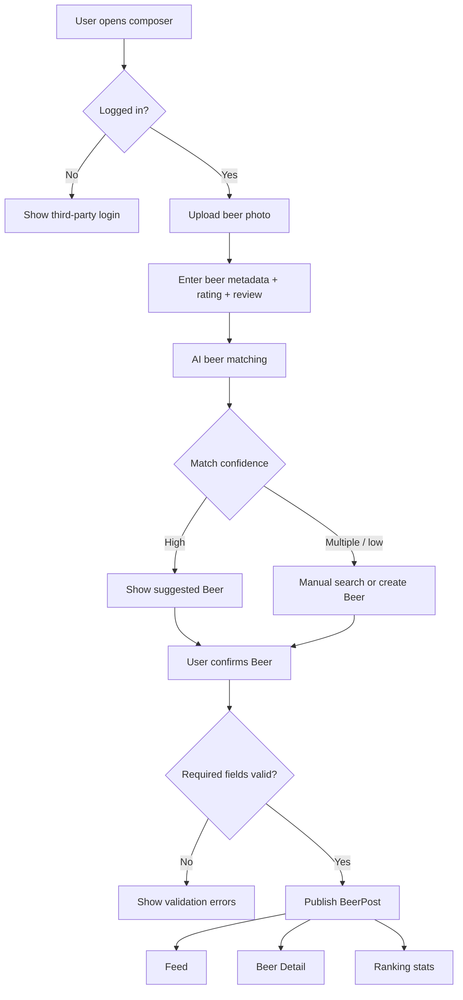
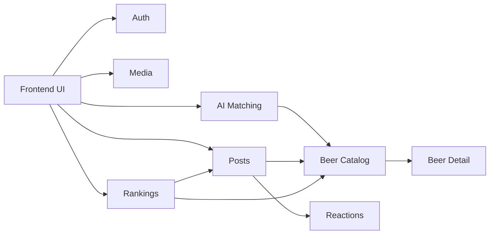

# BeerRank MVP — Flow, Architecture, and Data Alignment

## Purpose
This document is the shared contract between UIUX, frontend, backend, data model, and AI design work. It exists so BeerRank's screens, API behavior, data lifecycle, and ranking logic stay aligned while the workflow moves across nodes.

## Product Rule
BeerRank rankings are based on verified social reviews:

- A post means the user drank the beer.
- A valid ranking contribution requires a published post with a photo, beer association, rating, and author.
- A review post can contain up to three photos; the first photo is the primary proof photo.
- A review post can be public or private.
- Only public, published, confirmed review posts count toward rankings and appear in public Beer proof feeds.
- AI can suggest beer matching, but the user must confirm or correct the match before publishing.
- Beer rankings aggregate posts under a canonical Beer record.

## User Flow

### Flow A — Browse Feed
1. User opens BeerRank.
2. System loads recent published BeerPosts.
3. User scans post photo, beer name, brewery, style, rating, review, and like count.
4. User can click a beer name to open Beer Detail.
5. User can like a post if logged in.

Exceptions:
- Not logged in and taps like -> show login prompt.
- Feed has no posts -> show empty feed with CTA to post first review.
- Feed load fails -> show retry state.

### Flow B — Publish Beer Review With AI Matching
1. User taps create post.
2. System checks session.
3. If not logged in, system prompts third-party login.
4. User uploads one beer photo.
5. User enters or confirms beer name, brewery, style, optional ABV/country, rating, and short review.
6. System runs AI beer matching using image and entered metadata.
7. System shows matching result:
   - High confidence: suggested existing Beer with confidence and supporting signals.
   - Multiple candidates: list candidates for user selection.
   - Low confidence: manual search or create new Beer.
8. User confirms an existing Beer or creates a new Beer.
9. System validates required fields.
10. System publishes BeerPost and links it to Beer.
11. System updates feed and ranking statistics.

Exceptions:
- Image upload fails -> keep form values and show upload error.
- AI matching fails -> allow manual search/create, but do not block posting if user confirms Beer manually.
- User submits without Beer association -> block submit.
- User submits without rating/photo -> block submit.

### Flow C — View Beer Detail
1. User clicks a beer from feed or leaderboard.
2. System loads Beer canonical record.
3. System loads ranking stats and related BeerPosts.
4. User reviews average rating, rank, rating count, like count, and posts by people who drank it.
5. User can start a new post for the same Beer.

Exceptions:
- Beer has no posts -> show unavailable state; this should be rare because Beer Detail is usually reached through a post/ranking item.
- Beer data was merged or deprecated -> redirect to canonical Beer.

### Flow D — View Leaderboard
1. User opens leaderboard.
2. System loads BeerRankingStat ordered by rank_score.
3. User scans rank, beer name, brewery, style, average rating, rating count, like count, and score.
4. User clicks a row to open Beer Detail.

Exceptions:
- No eligible beers -> show empty leaderboard with explanation that rankings require posts with photos and ratings.
- Ranking load fails -> show retry state.

## Business Flow

### Publish Review
1. Frontend sends image upload request.
2. Media service stores image and returns storage path.
3. Frontend sends beer metadata draft and image reference for matching.
4. AI Matching service returns Beer candidates and confidence.
5. User confirms Beer association.
6. Frontend submits BeerPost create request.
7. Backend validates session, Beer association, image, rating, and review.
8. Backend creates BeerPost and PostImage.
9. Backend records resolved BeerMatchSuggestion.
10. Ranking stats are refreshed by query/view or async job.
11. API returns created post with expanded beer/profile data.

### Ranking Calculation
1. Query published, non-deleted BeerPosts.
2. Group posts by canonical beer_id.
3. Calculate average_rating and rating_count.
4. Calculate like_count from likes on posts under the Beer.
5. Calculate draft rank_score:
   `average_rating * log10(rating_count + 1) + like_count * 0.05`
6. Sort descending by rank_score.

## State Flow

### BeerPost
- `draft`: local UI state before submit; not persisted as public content in MVP.
- `matching`: UI state while AI matching runs.
- `ready_to_publish`: UI has image, rating, review, and confirmed Beer.
- `published`: visible in feed, Beer Detail, and eligible for ranking.
- `deleted`: soft-deleted, hidden from feed/ranking.

Legal transitions:
- draft -> matching
- matching -> ready_to_publish
- ready_to_publish -> published
- published -> deleted

Illegal transitions:
- draft -> published without confirmed Beer.
- matching -> published without user confirmation.
- deleted -> published in MVP.

### BeerMatchSuggestion
- `pending`: AI suggestion created, waiting for user action.
- `accepted`: user selected suggested existing Beer.
- `rejected`: user rejected suggestion.
- `manual_resolved`: user chose another existing Beer or created a new Beer.
- `expired`: abandoned draft.

### Beer
- `active`: canonical Beer used for ranking.
- `needs_review`: user-created Beer that may need later moderation/merge.
- `merged`: duplicate Beer redirected to canonical Beer.

MVP note: merge tooling is out of scope, but the state is documented so data design does not block future cleanup.

## Module Architecture

| Module | Responsibility | Frontend Touchpoints | Backend/Data Touchpoints |
|---|---|---|---|
| Auth | Third-party login and session | login CTA, protected actions | session validation, profile bootstrap |
| Profiles | Public user identity | avatar/name on posts | profile records |
| Media | One-photo upload for posts | upload control, preview, upload error | storage path, file metadata |
| Beer Catalog | Canonical Beer/Brewery records | beer search, beer detail, match candidates | beers, breweries, canonical/merge state |
| AI Matching | Suggest existing Beer or new Beer | matching loading, candidates, confidence UI | match request, candidate scoring, audit record |
| Posts | Beer review publishing | composer, feed card, detail post list | BeerPost, PostImage |
| Reactions | Like/unlike | like button and counts | PostLike unique constraints |
| Rankings | Leaderboard and beer stats | leaderboard, beer detail stats | ranking query/view/job |

## API Boundary Draft

| Endpoint | Purpose | UI Consumer |
|---|---|---|
| `GET /feed` | Load recent published BeerPosts with profile, beer, image, like count | Feed |
| `POST /media/images` | Upload one post image or create upload target | Composer |
| `POST /beer-match/suggestions` | Return AI candidate Beer matches from image + metadata | AI matching step |
| `GET /beers/search?q=` | Manual beer search | Matching fallback |
| `POST /beers` | Create new Beer when no match exists | Matching fallback |
| `GET /beers/:id` | Load Beer detail and stats | Beer Detail |
| `GET /beers/:id/posts` | Load posts linked to Beer | Beer Detail |
| `POST /posts` | Publish a BeerPost after confirmed Beer association | Composer |
| `POST /posts/:id/like` | Like post | Feed, Beer Detail |
| `DELETE /posts/:id/like` | Unlike post | Feed, Beer Detail |
| `GET /leaderboard` | Load ranked Beer list | Leaderboard |

## Screen to System Mapping

| Screen / UI State | Required Data | API / Module | Notes |
|---|---|---|---|
| Feed loaded | posts, profiles, beers, images, likes | `GET /feed` | Beer name links to Beer Detail |
| Composer empty | auth state | Auth | Posting requires login |
| Image preview | local image + storage path | Media | Store after user selects image or on submit |
| AI matching loading | image path + metadata draft | AI Matching | Show progress, not final Beer |
| Match candidates | candidate Beer list + confidence | AI Matching + Beer Catalog | User must confirm |
| Low-confidence match | metadata draft | AI Matching + Beer Search | Manual search/create required |
| Publish disabled | validation state | Posts | Disabled until photo, rating, review, Beer confirmed |
| Beer Detail | Beer, stats, linked posts | Beer Catalog + Rankings + Posts | Proves rankings come from posts |
| Leaderboard | ranked Beer stats | Rankings | Rows link to Beer Detail |

## Data Model Draft

### Tables

| Table | Key Fields | Notes |
|---|---|---|
| `profiles` | `id`, `auth_user_id`, `display_name`, `avatar_url`, `created_at` | Public identity |
| `breweries` | `id`, `name`, `country`, `created_by`, `created_at` | User-created in MVP |
| `beers` | `id`, `brewery_id`, `name`, `style`, `abv`, `country`, `status`, `canonical_beer_id`, `created_by`, `created_at` | `canonical_beer_id` supports future merge |
| `beer_posts` | `id`, `user_id`, `beer_id`, `rating_overall`, `review_text`, `visibility`, `created_at`, `updated_at`, `deleted_at` | `beer_id` required before publish |
| `post_images` | `id`, `post_id`, `storage_path`, `alt_text`, `sort_order`, `is_primary`, `created_at` | Up to three images per post in MVP; first image is primary |
| `post_likes` | `id`, `post_id`, `user_id`, `created_at` | Unique `(post_id, user_id)` |
| `post_comments` | `id`, `post_id`, `user_id`, `parent_comment_id`, `body`, `created_at`, `deleted_at` | Comment thread; one-level replies for MVP |
| `comment_likes` | `id`, `comment_id`, `user_id`, `created_at` | Optional comment reactions |
| `beer_match_suggestions` | `id`, `post_id`, `suggested_beer_id`, `confidence_score`, `source_signals`, `status`, `created_at`, `resolved_at` | Audit AI matching |
| `beer_ranking_stats` | `beer_id`, `average_rating`, `rating_count`, `like_count`, `rank_score`, `updated_at` | Can be view/materialized view/job |

### Indexes
- `beer_posts.beer_id`: Beer Detail and ranking aggregation.
- `beer_posts.created_at`: feed ordering.
- `post_likes.post_id`: like counts.
- `post_likes(post_id, user_id) unique`: prevent duplicate likes.
- `beers(name, brewery_id)`: matching/search.
- `beer_match_suggestions.post_id`: audit per post.

## Frontend / Backend Alignment Rules
1. Frontend must not show a post as publishable until Beer association is confirmed.
2. Backend must reject published posts without `beer_id`, image, rating, and authenticated user.
3. Ranking must count only published, non-deleted posts.
4. Beer Detail must be the source that proves which posts contributed to a Beer ranking.
5. AI matching is advisory; user confirmation is the product truth in MVP.
6. UI states for loading/empty/error must map to explicit API states, not generic fallback screens.

## Mermaid Overview

